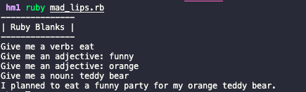

# Homework 1: Mad Lips Game

[Bulgarian translation](#bulgarian)

## Overview

Build a simple Mad Lips game using Ruby

**Mad Libs**<br>
According to Wikipedia, "Mad Libs is a phrasal template word game where one player prompts others for a list of words to substitute for blanks in a story before reading aloud."

**How it works**

- There is a sentence with blanks in it
- In each blank a cetain type of word should be put (a noun, verb or adjective)
- Prompt the user to provide each type of word
- Output the sentence with the user provided words in the blanks

 
## Challenge

- Use the sentence *"I planned to ______ a _______ party for my _______ _______"*
- Decide for each blank what kind of word you want in it and put it in a array:<br>
```
blanks = ['verb', 'adjective', 'adjective', 'noun'];
```
- Ask the user to provide each type of word, using prompt like *"Give me a _______:"*
- Make sure when prompting the user to use the correct article:<br>
*Give me **a** noun*<br>
*Give me **an** adjective*
- Keep track of the user answers in an array:<br>
```
answers = ['throw', 'big', 'best', 'fiend']
```
- Then replace the blanks in the sentence with the answers and output the result
- The output of running your program should look something like this:



## Hints and Tips
- You may find the Ruby documentation at ruby-doc.org helpful to have on hand.
- use the provided `mad_lips.rb` file for you program (I already provided the game headline for you)
- Use `puts` and `print` to output the the screen and `gets` to get input from the user. You might find `gets.chomp` useful


## Grading: 
 - Total score for this assignment: 100
 - This assignment represents 1/3 of your midterm grade

### Grading Criteria

| Score       | Criteria    |
| ----------- | ----------- |
| A. Program execution (50%) |
| 50    | Program runs correctly |
| 25    | Program produces correct output half of the time |
| 10    | Program runs, but mostly incorrectly |
| 0     | Program does not run at all |
| B. Specification Satisfaction (50%) |
| 50    | Program satisfies specification completely and correctly|
| 25    | Program satisfies half of the specifications|
| 10    | Many parts of the specification not implemented 
| 0     | Program does not satisfy specification |
| C. Bonuses |
| 5     | Well-formatted, understandable code; appropriate use of language capabilities |
| 5     | Solution well thought out |    

### Grading Scale

| Score       | Grade       |
| ----------- | ----------- |
| 0 - 60 | 2 |
| 61 - 70 | 3 |
| 71 - 80 | 4 |
| 81 - 90 | 5 |
| 91 - 100 | 6 |  
<br>
<br>
<br>


---------
<br>

# Домашна Работа 1: Mad Lips Game <a id="bulgarian"></a>

## Общ Преглед

Създайте играта Mad Lips изполвайки Ruby

**Как трябва да работи**

- Зададено е изречение с празни места в него
- На всяко празно място трябва да се постави определен тип дума (съществително, глагол или прилагателно)
- Поискайте от потребителя да въведе всяка една дума
- Изведете на екрана изречението след като замените празните места с предоставените от потребителя думи

 
## Условия на задачата

- Използвайте изречението *"I planned to ______ a _______ party for my _______ _______"*
- Преценете с какъв тип дума желаете да бъде попълнено всяко празно място и създайте масив с типовете:<br>
```
blanks = ['verb', 'adjective', 'adjective', 'noun'];
```
- Поискайте от потребителя да въведе тип дума със съобщение от вида: *"Give me a _______:"*
- Използвайте правилния неопределителен член в зависимост от това за какъв тип дума питате потребителя (използвайте правилата на ангийски език - пред съгласна се използва **a**, пред гласна се използва **an** <br>
*Give me **a** noun*<br>
*Give me **an** adjective*
- Пазете отговорите на потребителя в масив:<br>
```
answers = ['throw', 'big', 'best', 'fiend']
```
- След това заменете празните места в изречението с отговорите и изведете резултата на екрана
- Резултатът от стартирането на вашата програма трябва да изглежда по следния начин:


## Съвети
- Документацията на Ruby на ruby-doc.org може да ви бъде полезна.
- Използвайте създадения файл `mad_lips.rb`, в който да напишете вашата програма (Написала съм първите няколко реда за принтиране на заглавието на играта)
- Използвайте `puts` и `print` за извеждане на екрана, `gets` за получаване на вход/инпут от потребителя. Използването на `gets.chomp` може да ви е от полза.


## Оценяване: 
 - Общия брой точки за задачата: 100
 - Тази домашна работа представлява 1/3 от първата текуща оценка

### Критерии за оценяване

| Точки       | Критерии    |
| ----------- | ----------- |
| A. Изпълнение на програмата (50%) |
| 50    | Програмата се изпълнява правилно и работи |
| 25    | Програмата се изпълнява на половина правилно |
| 10    | Програмата се изпълнява, но през по-голямата си част неправилно |
| 0     | Програмата изобщо не се изпълнява |
| B. Спецификация (50%) |
| 50    | Програмата отговаря на спецификацията напълно и правилно |
| 25    | Програмата отговаря на половината от спецификациите |
| 10    | Много части от спецификацията не са имплементирани или са грешни |
| 0     | Програмата не отговаря на изискванията поставени в условието |
| C. Bonuses |
| 5     | Добре форматиран, разбираем код; подходящо използване възможностите на езика |
| 5     | Решението е добре обмисленно |    

### Скала за оценване

| Точки       | Оценка      |
| ----------- | ----------- |
| 0 - 60 | 2 |
| 61 - 70 | 3 |
| 71 - 80 | 4 |
| 81 - 90 | 5 |
| 91 - 100 | 6 |  
