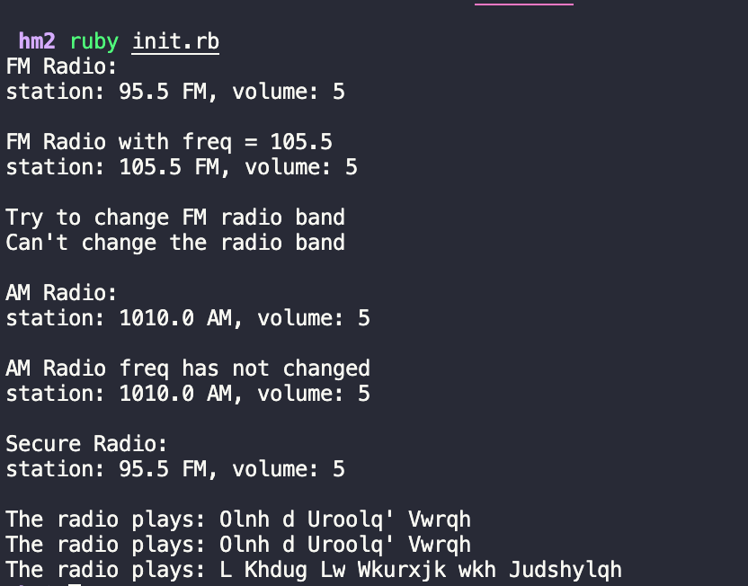

# Homework 2: Radio

## Overview

Homework 2 focuses on Ruby Classes And Objects. You should build **Radio** and **SecureRadio** classes and a **ShiftCipher** helper class following the requirements described below.

## Challenge

- A Radio class is defined in the classes folder
- It has controls for volume and a status method that returns the current volume

### Part 1

- Write an `initilize` method for the Radio class
- Add control for band - it can be one of the following: 'AM' or 'FM'
- Set default value for band in the initialize method
- Band can be read but **not changed**
- Add control for frequency (use freq in short)
- Set default value for freq in the initialize method
- Ensure frequency value stay in an allowed range (no need to show any kind of error just don't allow to change the frequency if it is out of range):
    - FM: 88.0 - 108.0
    - AM: 540.0 - 1600.0
- Add class methods to create different band radio:
    - `Radio.am` should create an AM radio
    - `Radio.fm` should create a FM radio
- Change the `status` method to return the radio band, frequency and volume

### Part 2: Secure Radio

- In the Radio class there is a `play` method which randomly picks an "audio stream" from the `@@audio_samples` array and "plays"
- Define `SecureRadio` class that inherit from Radio
- `SecureRadio` is just like the `Radio` class but `SecureRadio#play` (the instance `play` method) returns encrypted audio stream 
- For encrypting the audio stream use shift cipher which replaces each character with a letter a fixed number of positions down the alphabet 
e.g. with shift of 3: A => D, B => E, C => F ... Z => C
- Creat a new class `ShiftCipher` and implement class method to help you encrypt the string
    - `ShiftCipher.encode(plain_string, 3)`
- Use `ShiftCipher` in `SecureRadio` class to encrypt the audio stream

### Hints: ShiftCipher

- `[*'a'..'z']` expands a range into an array
- useful methods: `Array#map`, `Array#include?`, `Array#find_index`, `Array#join`
- You might find the modulo operator helpful for the transformations: `28 % 26` returns 2

### Hints

- Use irb to test your implementation while working on it
- Use the `init.rb` to test your implementation once you are done. The output should be similar to the following:

## Grading: 
 - Total score for this assignment: 100
 - This assignment represents 1/3 of your midterm grade

### Grading Criteria

| Score       | Criteria    |
| ----------- | ----------- |
| A. Program execution (50%) |
| 50    | Program runs correctly |
| 25    | Program produces correct output half of the time |
| 10    | Program runs, but mostly incorrectly |
| 0     | Program does not run at all |
| B. Specification Satisfaction (50%) |
| 50    | Program satisfies specification completely and correctly|
| 25    | Program satisfies half of the specifications|
| 10    | Many parts of the specification not implemented 
| 0     | Program does not satisfy specification |
| C. Bonuses |
| 5     | Well-formatted, understandable code; appropriate use of language capabilities |
| 5     | Solution well thought out |    

### Grading Scale

| Score       | Grade       |
| ----------- | ----------- |
| 0 - 60 | 2 |
| 61 - 70 | 3 |
| 71 - 80 | 4 |
| 81 - 90 | 5 |
| 91 - 100 | 6 |  
 
 
 
